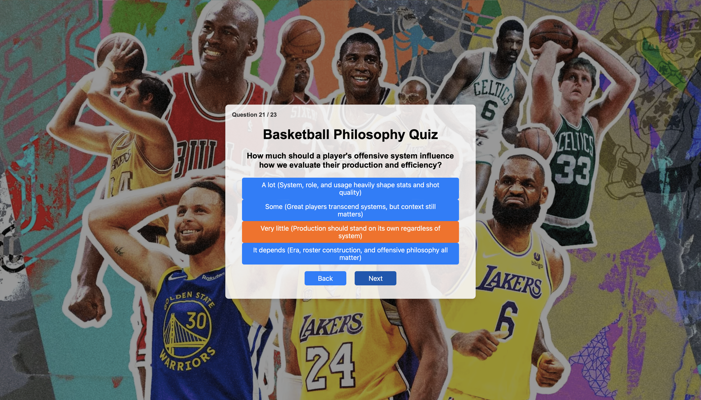
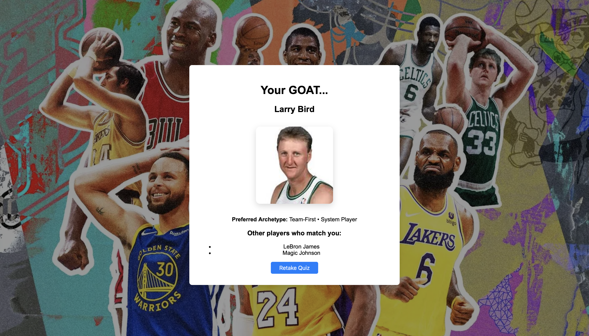

# GOAT

GOAT is a full-stack web application that matches users with professional basketball players whose playstyles best match their preferences. The application collects user responses through an interactive quiz and compares them with player attribute profiles to determine the closest match.

## Screenshots

### Quiz Interface

### Results

## Tech Stack

- C++ for the initial implementation
- Node.js, Express.js, JavaScript
- Fetch API
- Vanilla HTML/CSS
- Docker
- Kubernetes

## Build and Run (Node.js)
Run 

git clone https://github.com/cegbuji14/TheGreatest.git

cd TheGreatest

cd node

npm install

npm start
 
Open browser and go to
http://localhost:3000

## Running GOAT with Docker

### Prerequisites
- [Docker CLI](https://docs.docker.com/get-docker/) installed and running  
- [Colima](https://github.com/abiosoft/colima) to run Docker locally if you’re on an older Mac without Docker Desktop, consider using 

### Build  Docker Image

From the backend folder (where your `Dockerfile` lives), run:

Run 

docker build -t basketball-backend .
docker run --rm -it -p 3000:3000 basketball-backend

## Kubernetes Deployment

This project includes Kubernetes manifests to deploy the backend service locally using [Colima](https://github.com/abiosoft/colima) and [k3s](https://k3s.io/).

### Prerequisites

- [Docker](https://www.docker.com/get-started)  
- [Colima](https://github.com/abiosoft/colima) (with Kubernetes enabled)  
- `kubectl` CLI installed (e.g., via `brew install kubectl`)

### Start Colima with Kubernetes

Run

colima start --kubernetes

To deploy backend:
kubectl apply -f k8s/deployment.yaml

Expose service:
kubectl apply -f k8s/service.yaml

Access in browser:
http://localhost:30080

## Build and Run (C++)
Run

git clone https://github.com/cegbuji14/TheGreatest.git

cd TheGreatest/cpp-version/

Compile all source files with:

clang++ -std=c++17 main.cpp player_data.cpp match.cpp questionaire.cpp -o app

./app
